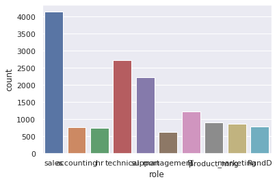
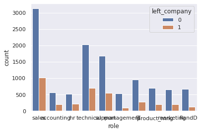
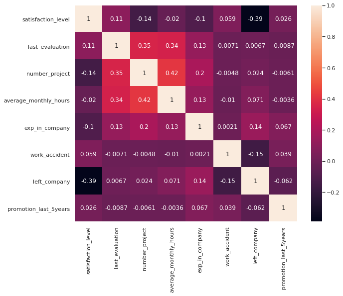
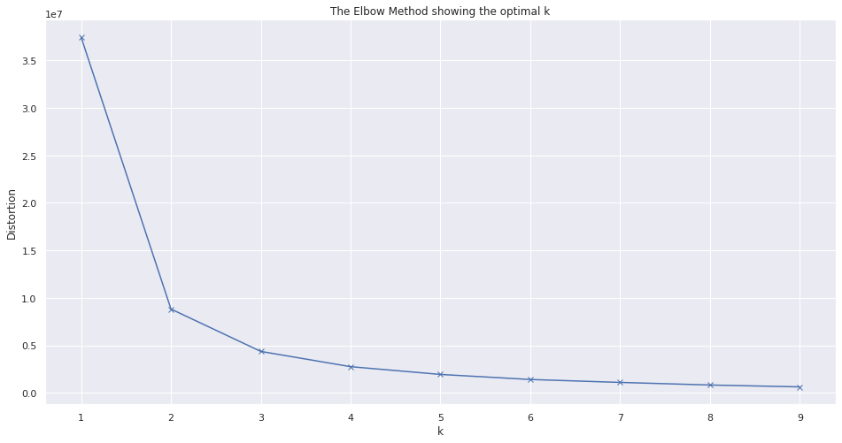
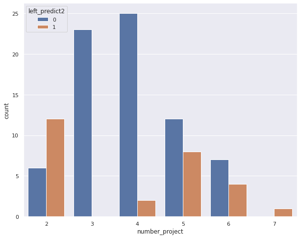

```python
# For ignoring future warning messages
import warnings
warnings.simplefilter(action='ignore', category=FutureWarning)

import pandas as pd
import numpy as np
import seaborn as sns
import matplotlib.pyplot as plt
from sklearn.cluster import KMeans

%matplotlib inline
sns.set()
```

Importing data into pandas dataframe from csv file


```python
df = pd.read_csv("HR_dataset.csv")
```

Doing data exploration


```python
df.sample(10)
```


<div>

<table border="1" class="dataframe">
  <thead>
    <tr style="text-align: right;">
      <th></th>
      <th>names</th>
      <th>satisfaction_level</th>
      <th>last_evaluation</th>
      <th>number_project</th>
      <th>average_monthly_hours</th>
      <th>exp_in_company</th>
      <th>work_accident</th>
      <th>left_company</th>
      <th>promotion_last_5years</th>
      <th>role</th>
      <th>salary</th>
    </tr>
  </thead>
  <tbody>
    <tr>
      <th>13813</th>
      <td>Ray Lowman</td>
      <td>0.59</td>
      <td>0.50</td>
      <td>2</td>
      <td>162</td>
      <td>2</td>
      <td>0</td>
      <td>0</td>
      <td>0</td>
      <td>management</td>
      <td>high</td>
    </tr>
    <tr>
      <th>8959</th>
      <td>Lester Shady</td>
      <td>0.32</td>
      <td>0.67</td>
      <td>5</td>
      <td>224</td>
      <td>4</td>
      <td>1</td>
      <td>0</td>
      <td>0</td>
      <td>accounting</td>
      <td>medium</td>
    </tr>
    <tr>
      <th>10730</th>
      <td>Peter Murray</td>
      <td>0.74</td>
      <td>0.83</td>
      <td>4</td>
      <td>210</td>
      <td>3</td>
      <td>0</td>
      <td>0</td>
      <td>0</td>
      <td>support</td>
      <td>low</td>
    </tr>
    <tr>
      <th>10197</th>
      <td>Donna Penrod</td>
      <td>0.50</td>
      <td>0.40</td>
      <td>2</td>
      <td>108</td>
      <td>2</td>
      <td>0</td>
      <td>0</td>
      <td>0</td>
      <td>technical</td>
      <td>medium</td>
    </tr>
    <tr>
      <th>6808</th>
      <td>Pamela Kraft</td>
      <td>0.72</td>
      <td>0.99</td>
      <td>4</td>
      <td>156</td>
      <td>2</td>
      <td>1</td>
      <td>0</td>
      <td>0</td>
      <td>sales</td>
      <td>low</td>
    </tr>
    <tr>
      <th>6652</th>
      <td>Matthew Cantrell</td>
      <td>0.13</td>
      <td>0.88</td>
      <td>3</td>
      <td>146</td>
      <td>5</td>
      <td>0</td>
      <td>0</td>
      <td>0</td>
      <td>sales</td>
      <td>low</td>
    </tr>
    <tr>
      <th>5216</th>
      <td>Robert Colston</td>
      <td>0.45</td>
      <td>0.64</td>
      <td>5</td>
      <td>133</td>
      <td>4</td>
      <td>0</td>
      <td>0</td>
      <td>0</td>
      <td>accounting</td>
      <td>medium</td>
    </tr>
    <tr>
      <th>10621</th>
      <td>Karen Ruthledge</td>
      <td>0.41</td>
      <td>0.68</td>
      <td>3</td>
      <td>191</td>
      <td>4</td>
      <td>0</td>
      <td>0</td>
      <td>0</td>
      <td>sales</td>
      <td>medium</td>
    </tr>
    <tr>
      <th>14823</th>
      <td>Lou Garnett</td>
      <td>0.37</td>
      <td>0.47</td>
      <td>2</td>
      <td>138</td>
      <td>3</td>
      <td>1</td>
      <td>1</td>
      <td>0</td>
      <td>accounting</td>
      <td>medium</td>
    </tr>
    <tr>
      <th>2326</th>
      <td>Larry Strissel</td>
      <td>0.56</td>
      <td>0.66</td>
      <td>3</td>
      <td>212</td>
      <td>2</td>
      <td>0</td>
      <td>0</td>
      <td>0</td>
      <td>technical</td>
      <td>medium</td>
    </tr>
  </tbody>
</table>
</div>


```python
df.describe()
```


<div>

<table border="1" class="dataframe">
  <thead>
    <tr style="text-align: right;">
      <th></th>
      <th>satisfaction_level</th>
      <th>last_evaluation</th>
      <th>number_project</th>
      <th>average_monthly_hours</th>
      <th>exp_in_company</th>
      <th>work_accident</th>
      <th>left_company</th>
      <th>promotion_last_5years</th>
    </tr>
  </thead>
  <tbody>
    <tr>
      <th>count</th>
      <td>15000.000000</td>
      <td>15000.000000</td>
      <td>15000.000000</td>
      <td>15000.000000</td>
      <td>15000.000000</td>
      <td>15000.000000</td>
      <td>15000.000000</td>
      <td>15000.000000</td>
    </tr>
    <tr>
      <th>mean</th>
      <td>0.612847</td>
      <td>0.716115</td>
      <td>3.803133</td>
      <td>201.052400</td>
      <td>3.498333</td>
      <td>0.144600</td>
      <td>0.238133</td>
      <td>0.021267</td>
    </tr>
    <tr>
      <th>std</th>
      <td>0.248628</td>
      <td>0.171171</td>
      <td>1.232590</td>
      <td>49.942074</td>
      <td>1.460139</td>
      <td>0.351709</td>
      <td>0.425955</td>
      <td>0.144277</td>
    </tr>
    <tr>
      <th>min</th>
      <td>0.090000</td>
      <td>0.360000</td>
      <td>2.000000</td>
      <td>96.000000</td>
      <td>2.000000</td>
      <td>0.000000</td>
      <td>0.000000</td>
      <td>0.000000</td>
    </tr>
    <tr>
      <th>25%</th>
      <td>0.440000</td>
      <td>0.560000</td>
      <td>3.000000</td>
      <td>156.000000</td>
      <td>3.000000</td>
      <td>0.000000</td>
      <td>0.000000</td>
      <td>0.000000</td>
    </tr>
    <tr>
      <th>50%</th>
      <td>0.640000</td>
      <td>0.720000</td>
      <td>4.000000</td>
      <td>200.000000</td>
      <td>3.000000</td>
      <td>0.000000</td>
      <td>0.000000</td>
      <td>0.000000</td>
    </tr>
    <tr>
      <th>75%</th>
      <td>0.820000</td>
      <td>0.870000</td>
      <td>5.000000</td>
      <td>245.000000</td>
      <td>4.000000</td>
      <td>0.000000</td>
      <td>0.000000</td>
      <td>0.000000</td>
    </tr>
    <tr>
      <th>max</th>
      <td>1.000000</td>
      <td>1.000000</td>
      <td>7.000000</td>
      <td>310.000000</td>
      <td>10.000000</td>
      <td>1.000000</td>
      <td>1.000000</td>
      <td>1.000000</td>
    </tr>
  </tbody>
</table>
</div>


```python
ax = sns.countplot(df['role'])
```


    

    


```python
ax = sns.countplot(x="role", hue= "left_company", data=df)
```


    

    


```python
corr = df.corr()
sns.set(rc={'figure.figsize':(10,8)})
sns.heatmap(corr, annot=True)
```


    <matplotlib.axes._subplots.AxesSubplot at 0x7f08d12a7e10>


    

    


**Observation**


1.  Maximum number of years in the company is 10 years and 75% of the employees are working 4 years or below in this company.
2.   Sales department has highest number of employees and highest turn over
3.   Attrition  rate of this company is 23%

* the dataset does not require data cleaning


For this prediction I am going to use KNN model and using the "Elbow Method" to find optimal K


```python
inputs = ['satisfaction_level','number_project', 'average_monthly_hours']

#Identify the optimal no. of k using the elbow method
distortions = []
K = range(1,10)
for k in K:
    kmeanModel = KMeans(n_clusters=k)
    kmeanModel.fit(df[inputs])
    distortions.append(kmeanModel.inertia_)
plt.figure(figsize=(16,8))
plt.plot(K, distortions, 'bx-')
plt.xlabel('k')
plt.ylabel('Distortion')
plt.title('The Elbow Method showing the optimal k')
plt.show()
```


    

    


The elbow method show optimal K value is 3

Using Sastifation Level, number of projects and average monthly hours as imput to predict if the employee will leave the company


```python
X = df[inputs]
y = df['left_company']
```

Splitting data for training(70%) and testing(30%)


```python
from sklearn.model_selection import train_test_split
X_train, X_test, y_train, y_test = train_test_split(X, y, test_size=0.3, random_state=1)
```

Train KNeighborsRegressor and show prediction accuracy


```python
from sklearn.neighbors import KNeighborsRegressor


knn_regressor = KNeighborsRegressor(n_neighbors=3)
knn_regressor.fit(X_train, y_train)

print('KNeighborsRegressor :', knn_regressor.score(X_test, y_test))
```

    KNeighborsRegressor : 0.6386993718865064
    

Train KNeighborsClassifier and show prediction accuracy


```python
from sklearn.neighbors import KNeighborsClassifier
from sklearn import metrics

knn_classifier = KNeighborsClassifier(n_neighbors=3)
knn_classifier.fit(X_train, y_train)
y_pred_class = knn_classifier.predict(X_test)

print('KNeighborsClassifier : ',metrics.accuracy_score(y_test, y_pred_class))
```

    KNeighborsClassifier :  0.9084444444444445
    

It shows that classification model has higher accuracy compare to regression model in this prediction.

hr_predict.csv is record of current employee in the company. using trained model to predict if the employee will stay or leave.


```python
predict = pd.read_csv("hr_predict.csv")
X_predict = predict[inputs]
predictions1 = knn_regressor.predict(X_predict)
predictions2 = knn_classifier.predict(X_predict)
```


```python
# Storing prediction result to dataframe

percent_left= (predictions1 * 100)
predict['left_predict_percent'] = percent_left.round(2)
predict['left_predict2'] = predictions2
predict
```


<div>

<table border="1" class="dataframe">
  <thead>
    <tr style="text-align: right;">
      <th></th>
      <th>id</th>
      <th>names</th>
      <th>satisfaction_level</th>
      <th>last_evaluation</th>
      <th>number_project</th>
      <th>average_monthly_hours</th>
      <th>exp_in_company</th>
      <th>work_accident</th>
      <th>promotion_last_5years</th>
      <th>role</th>
      <th>salary</th>
      <th>salary_class</th>
      <th>role_class</th>
      <th>left_predict_percent</th>
      <th>left_predict2</th>
    </tr>
  </thead>
  <tbody>
    <tr>
      <th>0</th>
      <td>2237</td>
      <td>Paul Mathey</td>
      <td>0.74</td>
      <td>0.72</td>
      <td>4</td>
      <td>176</td>
      <td>3</td>
      <td>0</td>
      <td>0</td>
      <td>sales</td>
      <td>low</td>
      <td>1</td>
      <td>1</td>
      <td>0.00</td>
      <td>0</td>
    </tr>
    <tr>
      <th>1</th>
      <td>8127</td>
      <td>Shawn Torres</td>
      <td>0.72</td>
      <td>0.88</td>
      <td>3</td>
      <td>224</td>
      <td>3</td>
      <td>0</td>
      <td>0</td>
      <td>technical</td>
      <td>low</td>
      <td>1</td>
      <td>2</td>
      <td>0.00</td>
      <td>0</td>
    </tr>
    <tr>
      <th>2</th>
      <td>8146</td>
      <td>Emily Staples</td>
      <td>0.52</td>
      <td>0.67</td>
      <td>4</td>
      <td>216</td>
      <td>3</td>
      <td>0</td>
      <td>0</td>
      <td>support</td>
      <td>medium</td>
      <td>2</td>
      <td>3</td>
      <td>0.00</td>
      <td>0</td>
    </tr>
    <tr>
      <th>3</th>
      <td>14441</td>
      <td>Jean Salazar</td>
      <td>0.42</td>
      <td>0.47</td>
      <td>2</td>
      <td>159</td>
      <td>3</td>
      <td>0</td>
      <td>0</td>
      <td>marketing</td>
      <td>low</td>
      <td>1</td>
      <td>6</td>
      <td>100.00</td>
      <td>1</td>
    </tr>
    <tr>
      <th>4</th>
      <td>11909</td>
      <td>Javier Folse</td>
      <td>0.85</td>
      <td>0.58</td>
      <td>4</td>
      <td>186</td>
      <td>7</td>
      <td>0</td>
      <td>0</td>
      <td>sales</td>
      <td>medium</td>
      <td>2</td>
      <td>1</td>
      <td>0.00</td>
      <td>0</td>
    </tr>
    <tr>
      <th>...</th>
      <td>...</td>
      <td>...</td>
      <td>...</td>
      <td>...</td>
      <td>...</td>
      <td>...</td>
      <td>...</td>
      <td>...</td>
      <td>...</td>
      <td>...</td>
      <td>...</td>
      <td>...</td>
      <td>...</td>
      <td>...</td>
      <td>...</td>
    </tr>
    <tr>
      <th>95</th>
      <td>12162</td>
      <td>Robert Davis</td>
      <td>0.45</td>
      <td>0.51</td>
      <td>2</td>
      <td>147</td>
      <td>3</td>
      <td>0</td>
      <td>0</td>
      <td>sales</td>
      <td>low</td>
      <td>1</td>
      <td>1</td>
      <td>100.00</td>
      <td>1</td>
    </tr>
    <tr>
      <th>96</th>
      <td>14646</td>
      <td>Kevin Reid</td>
      <td>0.41</td>
      <td>0.47</td>
      <td>2</td>
      <td>135</td>
      <td>3</td>
      <td>0</td>
      <td>0</td>
      <td>support</td>
      <td>low</td>
      <td>1</td>
      <td>3</td>
      <td>100.00</td>
      <td>1</td>
    </tr>
    <tr>
      <th>97</th>
      <td>10385</td>
      <td>Mary Valdez</td>
      <td>0.99</td>
      <td>0.50</td>
      <td>4</td>
      <td>173</td>
      <td>3</td>
      <td>0</td>
      <td>0</td>
      <td>management</td>
      <td>low</td>
      <td>1</td>
      <td>11</td>
      <td>0.00</td>
      <td>0</td>
    </tr>
    <tr>
      <th>98</th>
      <td>9524</td>
      <td>William Jaeger</td>
      <td>0.74</td>
      <td>0.55</td>
      <td>5</td>
      <td>168</td>
      <td>4</td>
      <td>0</td>
      <td>0</td>
      <td>management</td>
      <td>low</td>
      <td>1</td>
      <td>11</td>
      <td>0.00</td>
      <td>0</td>
    </tr>
    <tr>
      <th>99</th>
      <td>13936</td>
      <td>John Booker</td>
      <td>0.16</td>
      <td>0.63</td>
      <td>6</td>
      <td>286</td>
      <td>7</td>
      <td>0</td>
      <td>1</td>
      <td>sales</td>
      <td>medium</td>
      <td>2</td>
      <td>1</td>
      <td>33.33</td>
      <td>0</td>
    </tr>
  </tbody>
</table>
<p>100 rows × 15 columns</p>
</div>


Two columns were added left_predict_percent is percentage if employee will leave company using regression model and left_predict2 is prediction if employee is going to leave using clasification model (1 = will leave, 0=will stay).


```python
sns.countplot(x="number_project", hue="left_predict2", data=predict );
```


    

    


**Final Observation and Suggestion**

The reason that I include regression model result is to show percentage that an employee is going to leave where classification model is just showing leave or stay result.

1. Based on the prediction most of people with 2 projects per year are going to leave, this may show that they may wants more challenges.
2. Three or four projects per year has the less attrition rate
3. Managers with the staff left_predict_percent = 33.33% (or greater) can have 1:1 conversation with their staff to review their workload and to understand what excites them(if they want to retain their staff)


```python
# Saving results to csv file
predict.to_csv("final_predictions.csv")
```
